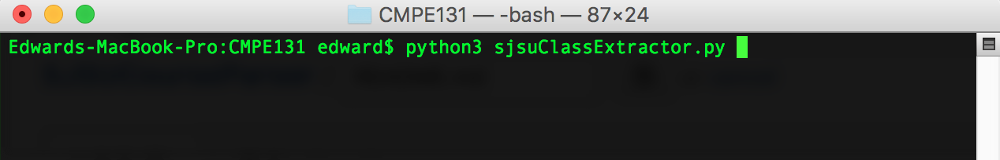

<h1>SJSU Course Parser</h1>

This script is intended to parse data only specific to the following webpage that contains the semester courses provided at SJSU
http://info.sjsu.edu/web-dbgen/splash/schedules.html

<h2>Example Data</h2>

<code>
AFAM 002A AFAM & DEV AM HIS/GV 03 46493 3 LEC D2 70 P 20/15 W 1800-2045 08/24/16-12/12/16 WSQ 207 K WHITE 
AFAM 102 AFRO-AMER MUSIC 01 47200 3 LEC P 5/30 W 1800-2045 08/24/16-12/12/16 MUS 250 V GROCE-ROBERTS 
AFAM 125 THE BLACK FAMILY 01 47198 3 LEC P 16/40 M 1800-2045 08/24/16-12/12/16 CCB 101 S MILLNER 
AFAM 152 THE BLACK WOMAN 01 47199 3 LEC P 8/40 T 1800-2045 08/24/16-12/12/16 CL 111 R WILSON 
AFAM 159 ECON ISSUES BLKCM 01 47197 3 LEC P 11/40 MW 1330-1445 08/24/16-12/12/16 CL 234 R WILSON 
AFAM 180 INDIVIDUAL STUDIES 01 46982 3 SUP P 0/10 TBA TBA 08/24/16-12/12/16 
</code>

<h2>Expected Results</h2>

  Items are sorted in CSV file with the following attribuites... 
  Course Number,  Course Name, Start Date, End Date, Instructor Name 
   
  EX. CHAD 060, CHILD DEVELOPMT 01, 08/24/16, 12/12/16, M WIEBE 

<h2>Steps for using Python Script</h2>

  <ul>
    <li>Download the corresponding year and semester that you wish to parse the data in</li>
    <li>Open pdf file in adobe or pdf reader and save as <code>sjsuclassdata.txt</code> file</li>
    <li>Run the command <code>iconv -f "iso-8859-1" -t "utf-8" sjsuclassdata.txt > sjsuclassdata-utf8.txt</code></li>
    <li>The above will convert the encoded file to a UTF-8 encoding which will allow the script to parse the data</li>
    <li>Run script and let the magic happen</li>
    <li>Data will be stored in the path <code>../misc/output.csv</code></li>
     
    
  </ul>

